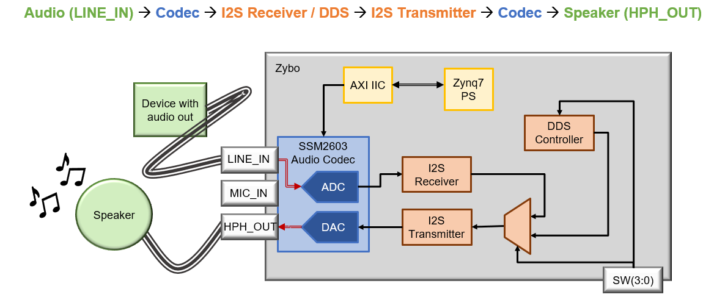
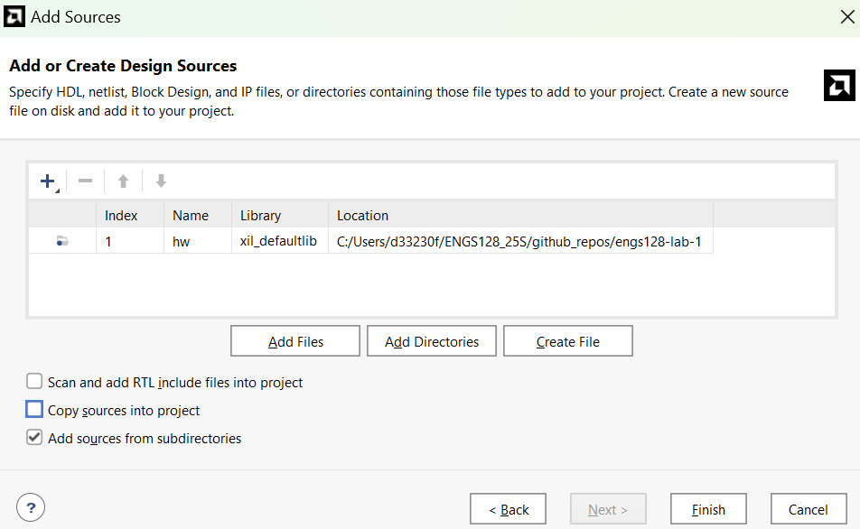
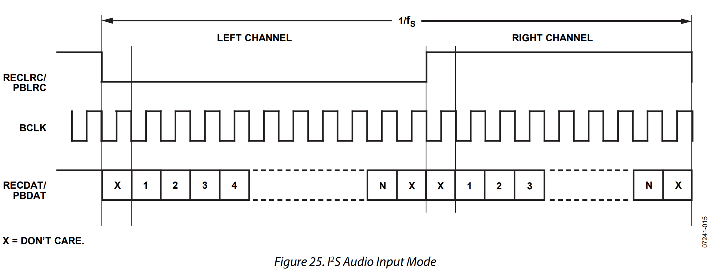
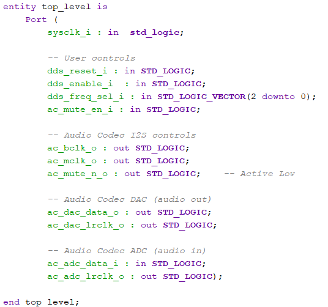
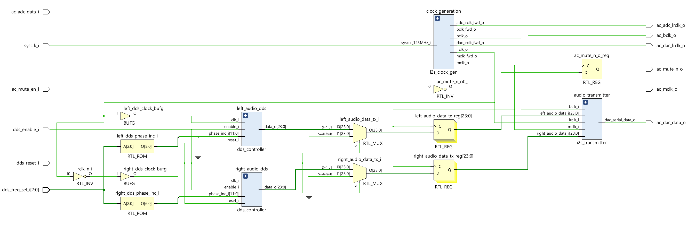
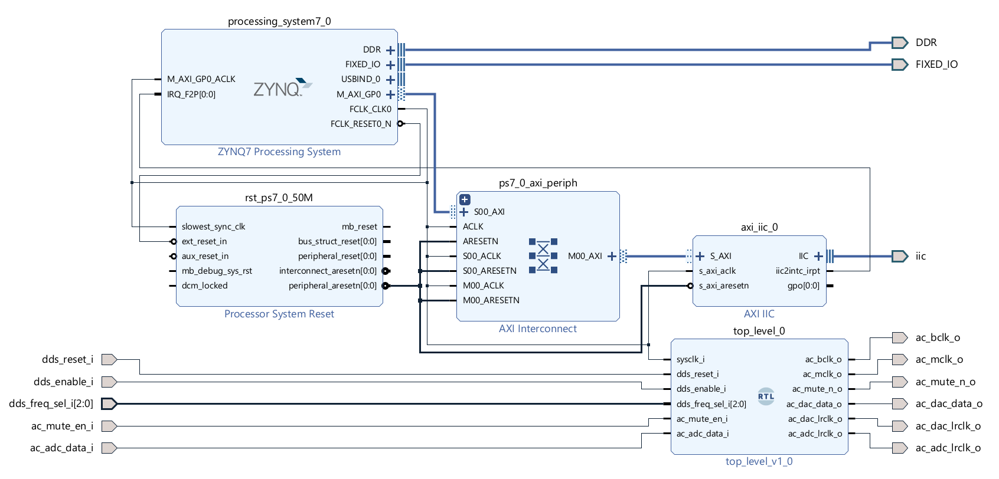
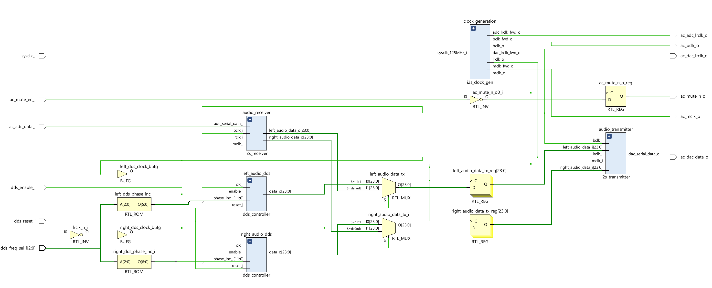
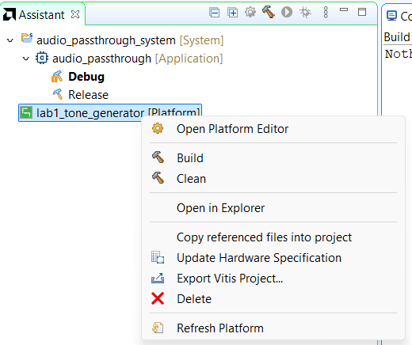

# ENGS 128 Lab 1 - Direct Digital Synthesis (DDS) and the Audio Codec

## Introduction
In this lab, you will design an I2S controller to receive and transmit audio data through the audio codec peripheral on the Zybo Z7-20 board. The onboard SSM2603 audio codec connects to the peripheral aux jack and speaker jack, allowing us to stream audio in through the aux port and listen to the output on an external speaker. The audio codec contains an ADC and DAC, which means it requires two interfaces (receiver and transmitter). 

Since we know that incremental design and test is *KEY* for robust digital design, we will start with the easiest to validate--the I2S transmitter design. 

To test the I2S transmitter design, you will implement a Direct Digital Synthesis (DDS) component capable of generating audio tones--this will provide a known input data stream for validating the I2S transmitter design. Once your I2S transmitter is working properly, you will design and implement the complementary I2S receiver and hook it back up to the transmitter. By the end of the lab, you will have designed and validated the full audio codec (ADC --> DAC) passthrough system, AND built an audio tone generator!

>[!Note]
>Given the high-resolution ADCs and DACs we are using in this lab, this audio should sound *good*. You will be able to tell if your data is getting corrupted in the passthrough. 

### Learning Objectives
* Develop understanding of DDS fundamentals and digital audio.
* Understand how to utilize and customize Xilinx IP cores in Vivado.
* Build skills to solve complex circuit design problems methodically using the incremental build and test FPGA design flow.
* Design and implement an I2S transmitter and receiver for interfacing the SSM2603 audio codec IC based on your reading of key datasheets.
* Learn how to integrate programmable logic (PL) with the Zynq PS using Vivado's IP integrator.
* Leverage AXI Lite and I2C to configure an external IC.

---

### Assignment Overview

#### Prelab Questions

Work with your partner to answer the prelab questions in `README_Prelab.md`. The prelab is dedicated to navigating through the technical documentation to find the specifications of the system you will be designing.

#### Retrieve the Starter Code

Before getting started on the design tasks, retrieve the starter code for the assignment. Fork this GitHub repo into your personal namespace, and clone the repo in a persistent directory (such as `O:/`, `/home`, or `C:/`, depending on your machine). Import the sources (uncheck Copy sources into project) into Vivado to allow you to backup your working copies of your code.

#### Design Tasks
1. `I2S Transmitter` design and simulation. This task will also include designing an `I2S Clock Generation` component to produce the I2S clock signals.
2. `DDS Controller` design and simulation.
3. `DDS -> I2S Transmitter` implementation using the IP integrator and Zynq PS.
4. `I2S Receiver` design, simulation, and implementation. In this task, you will implement the full `I2S Receiver -> I2S Transmitter` passthrough test.

>[!Tip]
>For each design task, you will need to:
>* Develop a paper design for the associated circuit block.
>* Translate your paper design into VHDL.
>* Generate and annotate the RTL schematic, checking to see if it aligns with your design on paper. 
>* Write a testbench to verify the timing and functionality of your component, and create annotated waveform figures based on your simulation that provide evidence that your design is working as intended.
>
>**Document as you go--all paper designs and annotated simulations will go in your post-lab report**

#### Postlab Report

The post-lab report instructions and evaluation details are outlined in `README_Postlab.md`--note that the majority of the post-lab report will consist of consolidating, organizing, and explaining the design documentation deliverables in each task, so it would be wise to document as you go. You and your partner are expected to work together on this--each lab group will submit one report.

---

## Task 1: Design an I2S Transmitter

In this task, you will design the I2S transmitter, as well as the clocking component that produces the I2S clocks. The I2S transmitter is more complex than the SPI controller we designed in class, but the design method is the same:
1. Draw out a datapath and controller--what status signals does your FSM have/need, and what control signals does it need to drive?
	* Like the SPI controller, we will need a shift register and counter in this datapath. You can reuse your `spi_controller.vhd` design file, and change the `data_sync_o` signal to `shift_done_o` (while the name doesn't have any physical implications, this change may intuitively make more sense--we can use this component to signal to an FSM that we have finished shifting the data)
	* We have more signals in the I2S bus--which ones can we use for driving our next state logic?
	* Design from the top-down, then work your way back up. This means, start by thinking about the highest-level ports, and which sub-components you might need in order to drive those signals (FSM, datapath elements, etc.). Then, design the lowest-level components, and work your way back up to meet the high-level requirements.
2. Translate the design to VHDL. Start by designing the lowest level components (like the reusable SPI controller design). Slowly build up your design hierarchy, incrementally checking the elaborated design to ensure your schematics look correct.
3. Write a testbench to simulate the behavior of your design. You may also need testbenches for sub-components, depending on the complexity.

### I2S Timing Specifications
As noted in the datasheet, you will need three clocks in this system:
* `MCLK`: 12.288 MHz
* `BCLK`: `MCLK/4`
* `LRCLK` (`RECLRC/PBLRC`): `BCLK/64` or `MCLK/256`. This clock sets the sampling rate.

Assume that the fabric clock will be the default system clock for the SoC: `125 MHz`.

While `MCLK` is not shown in the timing diagram below, `LRCLK` and `BCLK` are roughly shown: 

You will need to generate a wrapper for a timing circuit that:
* Generates these three clocks
* Safely forwards the clocks off the IC to the audio codec.
* Creates an unbuffered version of `LRCLK` that can be safely used with logic (remember, we never want to gate a clock).

Plan out a design on paper, then translate that into a VHDL model, leveraging scalable component instantiation, design hierarchy, and IP cores as appropriate. The top-level I2S timing entity should reside in  `i2s_clock_gen.vhd`, but you may want to create your own entity files to use as sub-components--you can choose those file names.

Write a testbench for your timing circuit, and run a simulation to verify that each clock/the sampling period is timed correctly. Fix any discrepancies in timing before moving on to the I2S transmitter design.

### I2S Transmitter Design 

On paper, design a datapath and controller that shifts data out per the SSM2603 datasheet timing diagram. Once you have finished, translate your design into VHDL--the top-level I2S transmitter entity should reside in `i2s_transmitter.vhd`, but you may create your own entity files to use as sub-components. Then, run elaboration and make sure that the design makes sense to you. 

Write a testbench, `tb_i2s_transmitter.vhd`, that instantiates your I2S timing block and your I2S transmitter. Start by driving a `test pattern`, or constant logic vector, into the I2S transmitter--choose a constant that has both the MSB and LSB = 1, and choose separate constants for the left and right audio. Verify that the serial data out is correct on the left and right channels, and that the interface timing matches the timing diagram from the datasheet (pay close attention to the timing of the serial data with respect to `BCLK` and `LRCLK`). Annotate your simulation waveform(s) to make it easy for the reader to see that your transmitter is, in fact, transmitting the correct signal with the correct timing.

### Submit
* Paper design for your I2S timing block (include calculated specifications)
* Paper design for your I2S transmitter (RTL schematic, FSM)
* Screenshots of the Vivado elaborated designs (`i2s_transmitter.vhd` and `i2s_clock_gen.vhd` schematics)
* Annotated simulation screenshots that clearly show the correct timing of your I2S signals. Include a close-up of the serial timing when driving the test pattern into the I2S transmitter. Make sure your left and right serial data streams look the same.

---

## Task 2: Design a DDS Module for Audio Tone Generation

To test an audio output, it is useful to transmit an audible signal--a constant value in the digital domain (like the test pattern) is converted to a DC voltage in the analog domain, which we can't hear. Instead, we will generate sine waves in the audible range to drive the audio codec data--if we've done everything correctly, we should hear some decent audio from headphone jack.

In this task, you will design a DDS module that can produce a 24-bit sine wave--your component has a 3-bit input signal that selects between the musical notes, or specific frequencies, shown in the tables below. The left and right audio tones will be one octave apart. Your DDS component should contain a phase accumulator, BRAM, and control logic. 

### Left Audio Tone Selection

| Select bits | Note | Frequency (Hz) |
| ----------- | ---- | -------------- |
| '000' | C4 | 261.63 | 
| '001' | D4 | 293.66 | 
| '010' | E4 | 329.63 | 
| '011' | F4 | 349.23 | 
| '100' | G4 | 392 | 
| '101' | A4 | 440 | 
| '110' | B4 | 493.88 | 
| '111' | C5 | 523.25 | 

### Right Audio Tone Selection

| Select bits | Note | Frequency (Hz) |
| ----------- | ---- | -------------- |
| '000' | C5 | 523.25 | 
| '001' | D5 | 587.33 | 
| '010' | E5 | 659.26 | 
| '011' | F5 | 698.46 | 
| '100' | G5 | 784 | 
| '101' | A5 | 880 | 
| '110' | B5 | 981.77 | 
| '111' | C6 | 1046.5 | 

### IO Specifications

**Inputs**
* `clk_i` : a 48 kHz clock 
* `reset_i` : control signal that resets the BRAM address to 0
* `enable_i` : increment phase when enabled
* `freq_sel_i` : 3-bit frequency select 

**Outputs**
* `data_o` : 24-bit DDS data output

---

### Design Steps
* On paper, design a DDS component that can output two octaves (C4 through C6). 
	* Given a 48 kHz sampling rate, what is the required phase resolution? 
	* How many samples do you need stored in memory? What size BRAM is required?
	* How many bits are the data and phase increment signals?
* Draw the RTL schematic for your DDS component, including the phase accumulator design, BRAM, and control logic.
* Translate your paper design to VHDL in the design source `dds_controller.vhd`.
	* Store the sine wave samples in a BRAM IP core using a COE file.
 	* Determine the phase increment values required for the specified left/right audio frequencies (C4 through C6).
* Elaborate the design, and check that the RTL makes sense.
* Write a testbench, `tb_dds_controller.vhd`, and simulate your design to validate the timing/frequency of the generated tones.

>[!TIP]
>Set the `dds_controller.vhd` file as the top design source to get the RTL to generate correctly.

### Submit
* Paper design (calculated specifications, RTL schematic, FSM if applicable)
* Screenshot of your Vivado elaborated design (`dds_controller.vhd` schematic)
* Annotated simulation screenshots that clearly show the functionality of your DDS controller.

---

## Task 3: Implement the DDS Tone Generator on the Zybo 

### Top-Level Wrapper

On paper, design a top-level component that hooks up 2 DDS controllers to your I2S transmitter design--one to drive the left audio stream, one to drive the right. Add the multiplexing logic for selecting the appropriate tones (specified in Task 2). Look ahead at the entity declaration to see the I/O ports your `top_level` component needs.

Translate your design to VHDL--wrap your DDS tone generators and I2S transmitter in a top-level file, `top_level.vhd`. Include the I2S receiver ports as well, so your entity declaration looks like the following:

At this stage, you can leave the serial audio data input port, `ac_adc_data_i`, open. We will implement this in Task 4.

Your top-level RTL should look something like this:

Write a testbench, `tb_top_level.vhd`, that simulates the tone generator design. Annotate your simulation waveform(s) to make it easy for the reader to see that 1) your I2S timing is correct, and 2) your tone generator is producing the correct frequencies to the left and right channels.

### Vivado Block Design

Create a block design that contains the Zybo PS, AXI IIC for configuring the audio codec, and your **DDS -> I2S Transmitter** top-level design. 

* Instantiate the processor. 
* Configure the processor to generate a 125 MHz fabric clock. 
* Run connection automation.
* Add an IIC IP core with the default configuration.
* Run connection automation (notice that this invokes an AXI interface).
* Add an interrupt that feeds from the IIC IP core to the processor (you will need to configure the IP to add the port). You may recall interrupts from ENGS 28 or ENGS 62. Essentially, they provide a direct path from hardware in the PL to "interrupt" the PS.
* Add your top-level VHDL component to the block design (`right-click > Add Module to Block Design`)

Set the IIC ports, I2S ports, reset signal, and frequency select signal as external ports (`right-click > Make External`). Your block design should look like this:

Create an HDL wrapper for implementation (select the block design source, `right-click > Create HDL Wrapper`), and add the provided `.xdc` constraint file to your design. Update the constraints file with the port names of your audio codec IO (see the HDL wrapper for these names). Use the following IO:
* Button `BTN0`: DDS reset signal, `dds_reset_i` 
* Button `BTN1`: audio codec mute enable signal, `ac_mute_en_i`
* Switches `SW0`, `SW1`, and `SW2`: DDS frequency selection control signal, `dds_freq_sel_i`
* Switch `SW3`: DDS enable signal, `dds_enable_i`

Generate the bitstream, and export your design to Vitis (`File > Export > Export Hardware`, and select `Include Bitstream`). Commit this `.xsa` file to your GitHub repo.

### Vitis C Application

To initialize the processor and configure the IIC bus, you will create a C application on your exported hardware platform. Start by downloading the software sources located in this repo's `sdk/` folder--this design utilizes AXI Lite to write values from C code on the PS into the I2C driver in fabric. By running the code as is, it will configure the audio codec IC into its default mode. 

The `main` function will initialize the PS interrupt handler, configure the I2C bus, and configure the audio codec IC using the I2C bus.

* The most interesting files are `audio.c` and `audio.h`, as these contain the functions for configuring the codec. 
* `iic.c` and `iic.h` are the I2C drivers for the IP core.
* `intc.c` and `intc.h` are the interrupt controllers for the PS.
* `main.c` essentially does the initial configuration, then sits in a while loop.
* `platform_config.h`, `platform.c`, and `platform.h` are the standard drivers required for startup and configuration of the Zynq processor.

Now, let's put this SDK to use. 

1. Open Vitis. 
2. Create a platform project using your XSA as the hardware platform, a system project, and an empty C application. 
3. Add the sources from the `sdk/` repo folder to your application `src/` folder: Right-click on the application > `Import Sources`. In the **from directory** panel, navigate to the sdk directory. 
4. Build the application, and run it on your Zybo board (`right-click > Launch Hardware`). Play with the onboard switches and buttons to validate the frequency switching and mute functionality. 

>[!WARNING]
>Make sure that your Zybo's programming pin-header is set to JTAG, not QSPI.
>Remember, Vivado and Vitis will get inconsistently upset if you have *any* spaces in your file paths--and stop working. If it breaks this way, it is particularly painful to debug, as the warnings do not point to this as the source/root of the issue.

### Submit
* Paper design for your DDS -> I2S transmitter top design (RTL schematic)
* Screenshot of your Vivado elaborated design (`top_level.vhd` schematic)
* Screenshot of your Vivado block design.
* Annotated simulation screenshots that clearly show the correct timing of your I2S signals
	* Include a close-up of the I2S transmitter signals. Show that the left and right serial data streams are correct, given the input DDS signal.
 	* Include a high-level screenshot that shows the left and right audio frequencies changing. 

---

## Task 4: Design an I2S Receiver for Audio Passthrough
   
Design an I2S receiver that implements the complement of the I2S transmitter--and shifts data *in* instead of *out*. Once you have completed your paper design, translate it into VHDL, using `i2s_receiver.vhd` as the entity file. Then, run elaboration and make sure that the design makes sense to you. 

The receiver is trickier to testbench than the transmitter--so we will test it in a pass-through test (transmitter to receiver). Create a new testbench, `tb_i2s_receiver.vhd`, that performs the passthrough test: **DDS -> I2S Transmitter -> I2S Receiver** (you have a lot of this code in other files already--reuse it!). To verify that your I2S receiver is working properly, make sure that the audio decoded from the I2S receiver is the same as the left/right audio generated by the DDS controllers. 

Next, modify your top-level file from Task 3, `top_level.vhd`, to include the I2S receiver as well. Use the port `dds_enable_i` to select between sending the DDS data to the I2S transmitter (1), or sending the converted I2S receiver data (0)--this is the audio codec passthrough test.

Modify the testbench `tb_top_level.vhd` to simulate your design and verify the timing of your I2S signals. 

Your top-level RTL should look something like this:

In the block design, right-click on your top-level component and select `Refresh Module` to import your design changes (check that the changes were imported by going to `Reports > IP Status` from the top menu bar). Generate the bitstream (re-run synthesis and implementation), and export your design to Vitis (`File > Export > Export Hardware`, and select `Include Bitstream`). Commit this `.xsa` file to your GitHub repo.

Open your Vitis project, and update the hardware platform with your new `.xsa` file--click on the platform in the `Assistant` panel, and `right-click > Update Hardware Specification`. 

You will demonstrate your design functionality on the assignment due date.

### Submit
* Paper design for your I2S receiver/DDS -> I2S transmitter top design (RTL schematic)
* Screenshot of your Vivado elaborated design (`top_level.vhd` schematic)
* Annotated simulation screenshots that clearly show the correct timing of your I2S signals
	* Include a close-up of the I2S transmitter and receiver signals when testing the I2S passthrough. Show that the input and output data streams are the same.
* Print out of your Vivado synthesis and implementation `Messages` panel (deselect `Info`, and select `Warnings`, `Critical Warnings`, and `Errors`). If any warnings remain, explain why they are benign.

---

## Postlab 

Follow the instructions in `README_Postlab.md`. For the Canvas assignment submission, you will upload:
1. A link to your group's GitHub repo containing all of your code (source and simulation)
2. A PDF of your post-lab report.
