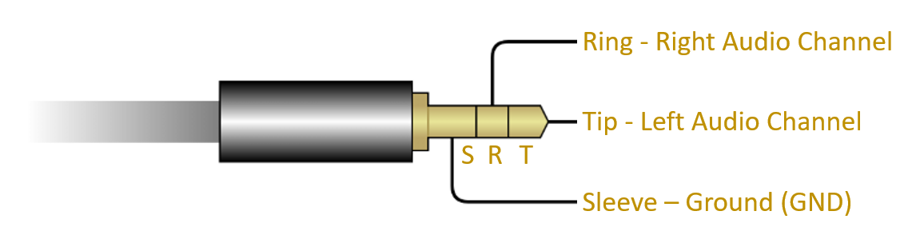
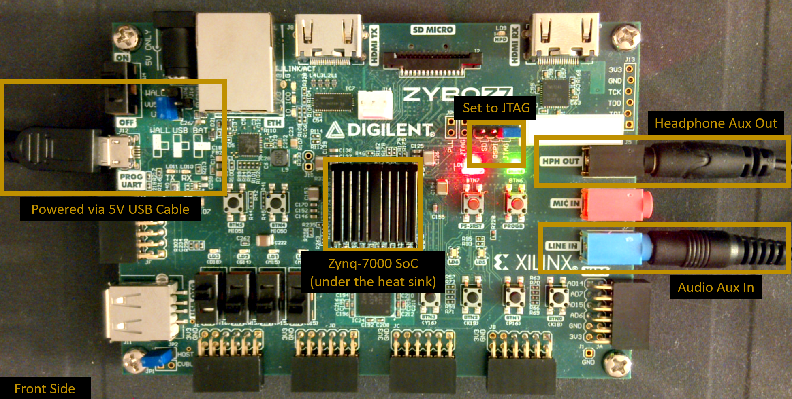
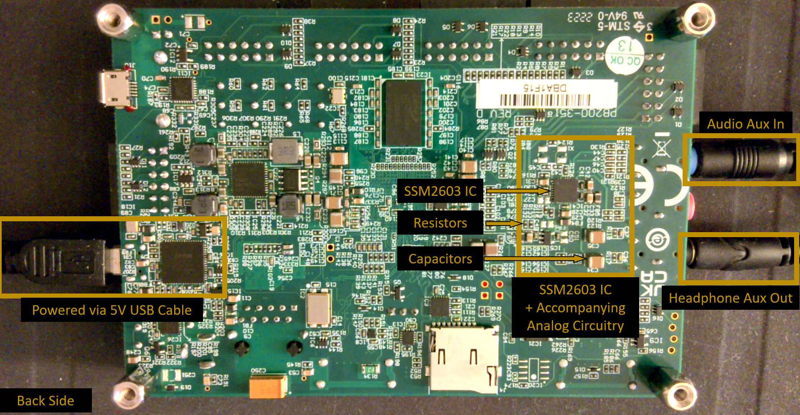
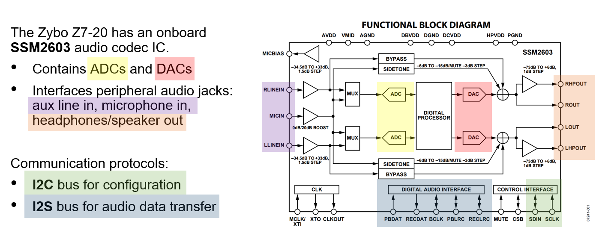

# ENGS 128 Lab 1 - Direct Digital Synthesis (DDS) and the Audio Codec

## Prelab Assignment

---

## Introduction to Digital Audio 

Audio, in the analog world, is made up of an infinite number of sine waves. Pure tones refer to a single sine wave, which is what we will generate to produce a musical note. In the digital world, we can approximate the analog sine wave with digital bits, which can be converted to the analog domain using a DAC, or converted from analog-to-digital using an ADC. 

Our Zybo development board contains a multitude of peripherals that we can easily access for our designs. For audio, we need both an ADC (to receive audio data) and DAC (to transmit audio). Fortunately, the Zybo contains the SSM2603 audio codec IC, which has both! The digital pins of the audio codec are wired to the Zynq-7000 SoC, and the analog pins are connected to auxiliary 3.5 mm audio jacks. These audio jacks are compatible with what is known as Tip, Ring, Sleeve (TRS) model, which encodes the left audio channel (the left speaker) in the tip, the right audio channel (the right speaker) in the ring, and the ground reference on the sleeve, as seen below (modified from the Digilent Audio Adapter Reference manual):

Both our input and output jacks use the TRS design. Specifically, the 3.5mm audio jacks are located on the right side of the Zybo Z7-20--stereo `LINE IN` (light blue) and `HEADPHONE OUT` (black)--and are presented below:

Notice the location of the Zynq-7000 IC (under the heat sink fins) and that we will need our boards to be set to JTAG mode in this lab (we will be using the PS).

The audio codec is large enough to warrant a separate IC on the Zybo Z7-20, which is located on the back of the board:

To communicate with this board from our SoC PS and PL, we will need to leverage two serial communication protocols that are dedicated to transferring data from one integrated circuit (IC) on a printed circuit board (PCB) to another:
* The **Inter IC Communication Protocol (IIC or I2C)** to configure the IC. 
* The **Inter-IC Sound (I2S)** Communication Protocol to stream the audio data.

>[!Important]
>While the SSM2603 relies on two communication protocols, the focus of this lab is on the **I2S implementation**. I2C is particularly tricky to implement in hardware, but fortunately the Zynq PS already has an I2C bus that we can leverage. For this lab, you have been given the SDK that enables the PS to configure the codec using the I2C bus.
>Critically, the provided SDK will configure the audio codec with the ***DEFAULT*** settings, which is important to know upfront as this influences our reading of the datasheets and some of the design decisions we will make. 

---

## Prelab Questions 

Complete the following scavenger hunt tasks *prior* to starting the lab so you have a clear understanding of the specifications you are designing for. If you have questions about I2S, make sure that you resolve them before you move on to the hardware design.

After you've answered all of the prelab questions, show your results to the Professor (you will also turn these in as part of the lab report). Once you have received the green light, you may get started on the lab!

---

### Zybo Z7-20 Reference Manual Audio Codec Scavenger Hunt
The board reference manual is typically a good place to start when bringing up new devices. [Open the Zybo reference manual to the section on audio](https://digilent.com/reference/programmable-logic/zybo-z7/reference-manual#audio) and read through the section. Work with your partner to answer the following questions:

1. Is the audio codec integrated into our Zynq SoC? How do you know?
2. What is the Manufacturer Part Number (MPN) of the audio codec? 
3. What communication protocol is used to transfer audio data?
4. What communication protocol is used to configure the audio codec?
5. We will need this later--what is the device address of the SSM2603?
6. What is the digital I/O voltage level of the IC? What does this say about the expected voltage range of the audio I/O signals?
7. What is the default sampling rate of the ADC/DAC?
8. For the default sampling rate, what is the required master clock?
9. If the clock needs to be forwarded off the Zynq IC, do we need an ODDR primitive? Why?

---

### SSM2603 Datasheet Scavenger Hunt

When we are bringing up a new device, it is essential to first read the datasheet to understand how it works. Specifically, it's a good idea to start by looking at the block diagram, schematic(s), specifications table(s), timing diagrams, and pin descriptions.

Refer to [the SSM2603 datasheet](https://www.analog.com/media/en/technical-documentation/data-sheets/ssm2603.pdf), and answer the following questions:

1. Based on your reading and understanding of the high-level block diagram below, what does this IC do?

Navigate to the section *PIN CONFIGURATION AND FUNCTION DESCRIPTIONS* on page 8 of 31.

2. In your own words, what does the pin `MCLK/XTI` do?
3. In your own words, what does the pin `BCLK` do?
4. In your own words, what does the pin `PBDAT` do?
5. In your own words, what does the pin `PBLRC` do?
6. In your own words, what does the pin `RECDAT` do?
7. In your own words, what does the pin `RECLRC` do?
8. In your own words, what does the pin `MUTE` do?
9. In your own words, what does the pin `SDIN` do?
10. In your own words, what does the pin `SCLK` do?

Scroll to the section *DIGITAL AUDIO INTERFACE*. There are lots of timing diagrams shown here--how do we know which one is the default for the Zybo board?  For this, we will need to look at the IC's configuration registers, listed in the *REGISTER MAP DETAILS* of the SSM2603 datasheet. Specifically, let's look at ADDRESS 0x07 (register 7), DIGITAL AUDIO I/F. 

11. What is the default digital audio input format control? 
12. While we are here, what is the default data word length? That is, how many bits are our ADC and DAC?

Return to the section *DIGITAL AUDIO INTERFACE*.

13. Which figure corresponds to the default input mode?
14. How do we know which audio channel our sample is associated with?
15. Which channel is transmitted first? Does it matter?
16. What is the relationship between `RECLRC/PBLRC` and the sampling frequency, `Fs`?
17. When does data start shifting? Which signal would be most useful for the next state logic in your FSM?
18. When, in relation to `BCLK`, is data shifted out? Which clock edge?
19. When, in relation to `BLCK`, is data shifted in? Which clock edge?
20. What does `X` mean in the diagram?
21. Which direction is the data shifted in (MSB to LSB, or LSB to MSB)?
22. What is the advantage of sampling and shifting 180 degrees out-of-phase? Why is it advantageous for our clock to have a 50% duty cycle in this case? 

There are a few "clocks" in this system--the master clock `MCLK` for the IC, the bit clock `BCLK` and the LEFT/RIGHT (also called word select or WS) clock, and `RECLRC` (Record Left/Right Clock) and `PBLRC` (Play Back Left/Right Clock)--which has specific timing requirements. Navigate to *Table 30. Sampling Rate Lookup Table, USB Disabled (Normal Mode)* on page 25. We will not use `CLKDIV2` to divide our input `MCLK` by 2 (`CLKDIV2 = 0`) in this lab. 

21. Given the default sampling rate and required `MCLK` value you found when reading the Zybo Z7-20 reference manual, what should `BCLK` be as a function of `MCLK`? That is, how many `MCLK` periods do we need to get one `BCLK` period?
22. What is the scaling factor between `MCLK` and the sampling frequency `Fs`? That is, how many `MCLK` periods do you need to get one sampling period, `Ts`?
23. In the default mode, how many `BCLK` cycles do we need to shift to get one sampling period, `Ts`? Why? 
24. Given the data packet width and the initial `X` cycle, how many `BCLK` cycles do we need to wait before the packet frame (`RECLRC/PBLRC`, aka the LEFT/RIGHT clock) changes state?
25. In your own words, summarize your findings from the previous questions. How does I2S work? Keep in mind that this timing diagram shows both the I2S *transmitter* and *receiver*.
26. Look back at the timing diagram presented in the <a href="https://digilent.com/reference/programmable-logic/zybo-z7/reference-manual#audio">Zybo reference manual section on audio</a>. Does this timing diagram match ANY of the timing diagrams in the SSM2603 datasheet? Does this concern you? Which do you think is more trustworthy?
